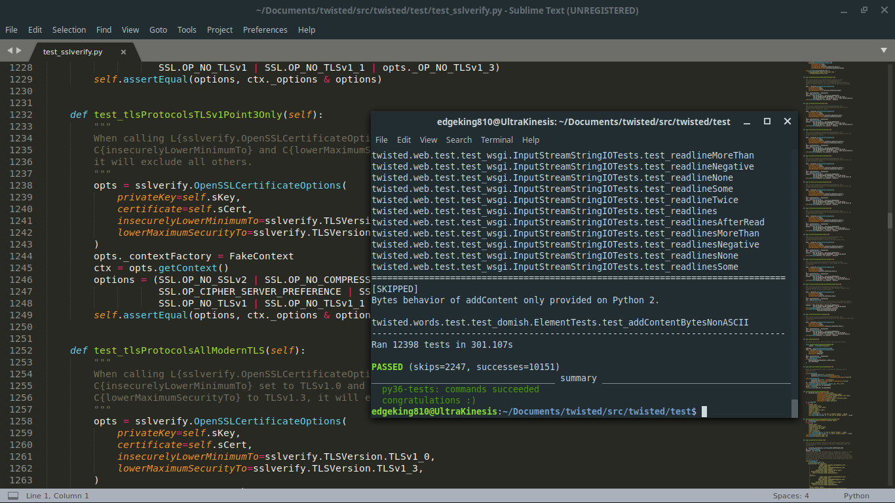

## What is an IETF?

"The Internet Engineering Task Force is an open standards organization, 
which develops and promotes voluntary Internet standards, in particular
the standards that comprise the Internet protocol suite. It has no 
formal membership or membership requirements". Volunteers can participate
and make a lot of changes to projects to, for instance, make these 
projects adopt latest security standards.

## What I did during the 104th iteration of IETF

The event started on a thursday and went on for 4 days but I could 
unfortunately not meet up with the team due to school. I was assigned 
with one task though; adding TLS 1.3 tests to an open source project 
named "twisted". Having been instructed where to begin with and being 
ignorant of unit tests, I still looked at the code and searched for 
instances of TLS and changed them to 1.3. I then tested my changes but 
obtained a lot of errors. I was given some tips and during the weekend, 
tried again from scratch.

First, I searched and learnt the differences betweeen TLS 1.2 and 1.3. 
TLS (Transport Layer Security) is a protocol offering security over 
computer networks. In short, 1.3 was faster and safer than 1.2. I also 
learnt that before TLS, SSL (Secure Sockets Layer) was being used. Then, 
I went on to learn and understand python unit tests. I recommend everyone 
wishing to learn these to read 
[this excellent article](https://realpython.com/python-testing/). I 
understood how important unit tests were, how to write/run them and what 
linters were in python. I deleted everything and forked twisted again. I 
edited the python test files and with each batch of changes, used tox, as 
recommended by the docs of twisted itself, to see if my tests were failing 
or not. I set TLS 1.3 as the minimum version for some tests and added one 
test just for it too. All the tests passed and I waited for a peer to 
check my code before submitting a pull request (PR). You can see my changes 
in [this commit](https://github.com/EdgeKing810/twisted/commit/4242ff36fa7fd0a79868bfe51f80b27e91389578).
