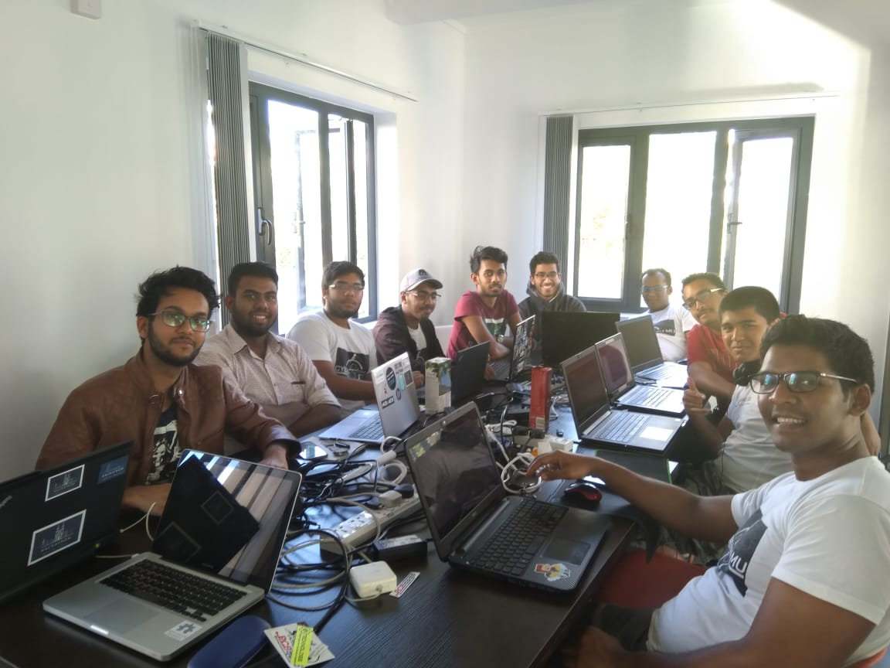
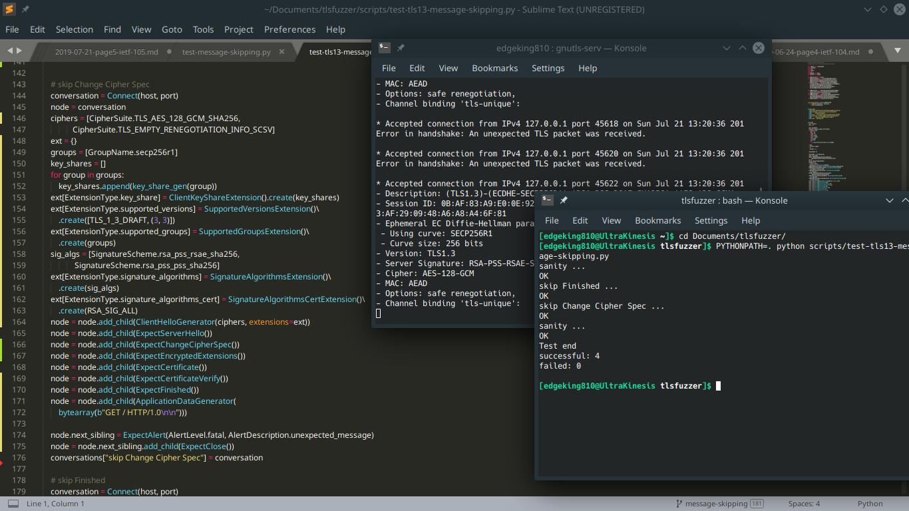
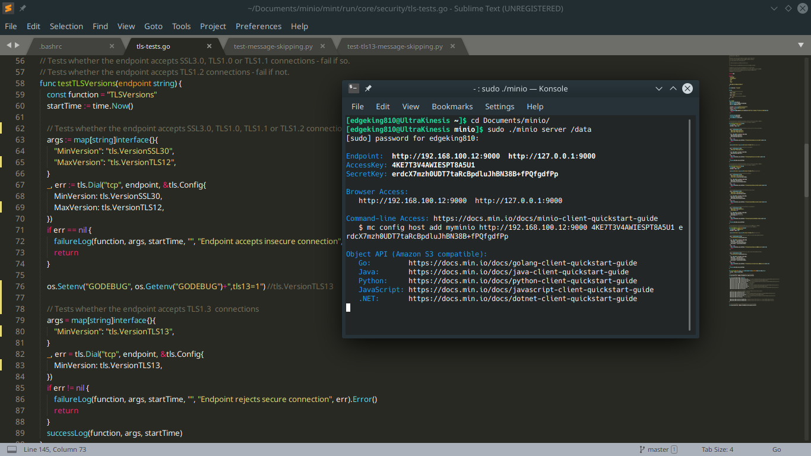

## The unsuccessful first days

I was really looking forward to this hackathon because for once, I was in school holidays.
The organisation I form part of [CyberStorm.mu](https://cyberstorm.mu), already had a list 
of tasks that we, the members could attempt. I didn't really know which one to pick. Most 
seemed easyones but I wanted something more challenging. I was then proposed to work 
on QUIC, which *is a new encrypted-by-default Internet transport protocol, that provides a 
number  of improvements designed to accelerate HTTP traffic as well as make it more secure, 
with the intended goal of eventually replacing TCP and TLS on the web*, but as I didn't
understanding a whole lot about what needed to be done, I got another task seemingly easier.

Like the last [IETF](https://blog.kinesisgames.net/2019-06-24-page3-ietf-104/), I was asked
to implement TLS 1.3 in a github repository. Basically [tlsfuzzer](https://github.com/tomato42/tlsfuzzer/)
has a lot of scripts that users can make use of to test a lot of cases on their server. I forked the
repo and immediately looked for do-able issues that have something to do with TLS 1.3. I cloned
my fork of the repo, setupped a GNU-TLS server and ran tests against it using these commands:


git clone https://github.com/EdgeKing810/tlsfuzzer/
cd tlsfuzzer/
openssl req -x509 -newkey rsa -keyout localhost.key -out localhost.crt -subj /CN=localhost -nodes -batch
gnutls-serv --http -p 4433 --x509keyfile localhost.key --x509certfile localhost.crt --disable-client-cert
PYTHONPATH=. python scripts/<scriptName>.py 


I worked the whole Thursday afternoon to add cipers and encryption algorithms to 2 scripts
while making sure these tests were still working but the owner of the repo told me that there
was another guy which *would probably continue working on this*. Well sure, that guy had
a Pull Request already but seemingly abandoned it since around 1 month. I didn't give up and
tried to solve another issue.

I found [this](https://github.com/tomato42/tlsfuzzer/issues/527) a good first issue to work on.
Basically, there was one script ``test-messaging.py`` that was responsible to check if connections
were allowed if specific things were missing in different cases. The task was to create another
script doing the same thing as the mentionned script but this time while using TLS 1.3. Since I
woke up until night, I tried to do this on Friday. I had to understand how the original script worked;
the statement that had to be omitted for different tests, the order to call functions and how all
of this had to be converted into the format for TLS 1.3. I tried my best but didn't manage to do what
was planned at the end of the day. I couldn't be able to omit statements in order to run different
test cases because these statements just weren't valid or existed in TLS 1.3. I reported back to 
the owner of the repo and it was now that he realised that it wasn't an easy thing to do and he
removed the 'good first issue' label on that issue. I was angry and pissed to having wasted my time.

## The Big Day

It was finally Saturday (date of this blog post). I woke up early, packed my laptop and went to meet
the other members of [CyberStorm.mu](https://cyberstorm.mu). We all then headed for The Kiosk at
Coromandel which will serve as our headquarters now. After unpacking wires and setting the
Internet up, we all got going with our respective tasks. There were several members of
[CyberStorm.mu](https://cyberstorm.mu) present; 
[Logan](https://medium.com/@loganaden), [Nitin](https://tunnelix.com),
[Jeremie](https://medium.com/@jeremiedaniel48), [Nathan](https://tecknologg.website/),
[Bruno](https://busymind101.wordpress.com/), [Jagveer](https://jagveerl.blogspot.com/) as well as many
students from the [University of Mauritius](http://uom.ac.mu/).

I paired up with Jeremie to implement TLS 1.3 in a high performance object storage server known
as [minio](https://github.com/minio/minio). After cloning the repo, we ran the server using the following
command in the minio directory and analyzed the packets using [wireshark](https://wireshark.org).


make all
sudo ./minio server /data


We faced a lot of issues and it wasn't so easy to make it work. We took a pause and attended a
quick course on [Ansible](https://www.ansible.com) (which is awesome af btw) by [Nitin](https://tunnelix.com). 
After eating and discussing a bit with the other attendees, we got back to work. Even if minio was written
in [go](golang.org), which neither me nor Jeremie were familiar with, we managed to work together
and make it support TLS 1.3! We had to change some fields to use TLS 1.3 and fallback to TLS 1.2 if
it didn't support the former as well as adding some TLS 1.3 ciphers. I shouted out of joy when we
finally saw TLS 1.3 entries in [wireshark](wireshark.org) and that was my experience of IETF 105!

